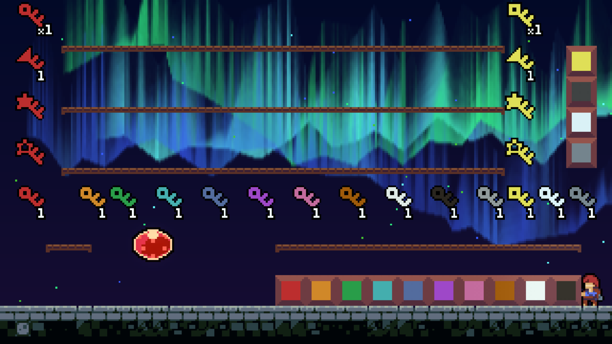

# LocksmithHelper

Puts the keys and doors from [I Wanna Lockpick by LAWatson](https://lawatson.itch.io/i-wanna-lockpick) into Celeste!

[](https://youtu.be/t6eDDkViZEk "LocksmithHelper Example")



## Usage

In order to have a key count show up in the level, there needs to be a `Counter` entity somewhere in each room. 

`Door` locks are specified in a comma-separated mapping of colors to complex values, optionally with a rectangle area where they are drawn.

Examples of valid locks:
```
Cyan: 2
Pink: -3+4i
White: 0 (unopenable without a master key)
Pink: 6 @ 6 6 18 18 (x, y, width, height)
Cyan: i
```
There are also blast, blank, and "all" locks, which are specified as follows:
```
Master: -ix (removes all imag. master keys, openable if count is negative)
White: blank (only opens with 0 white keys)
Purple: all (removes all keys)
```
Note that you can't have non-unit blast doors:
```
Black: 1+ix (will error on map load)
```


## Notes

I made this in 3 days and didn't have enough time to bugtest it because college classes start *tomorrow.*

Also, since I've never actually _played_ past like World 3, some things may be inaccurate, but I tried my best with checking things with KeyTool. 

There will be bugs. Please, please report them.
